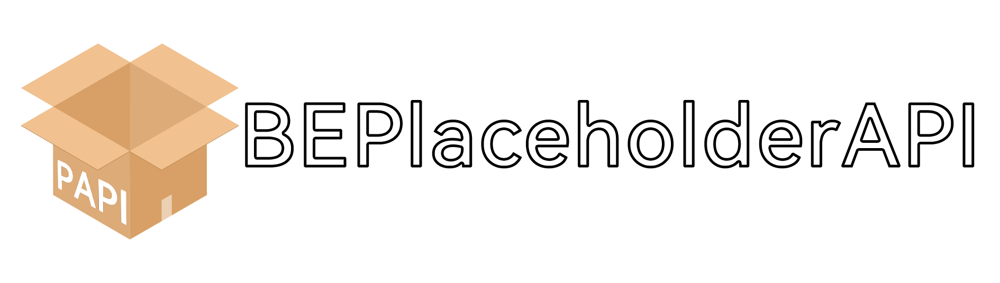
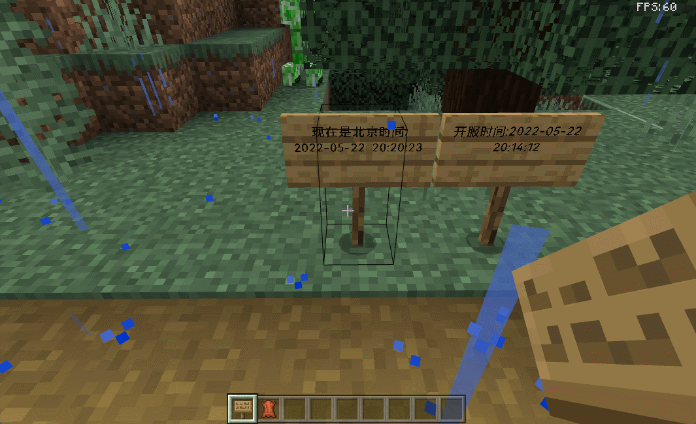
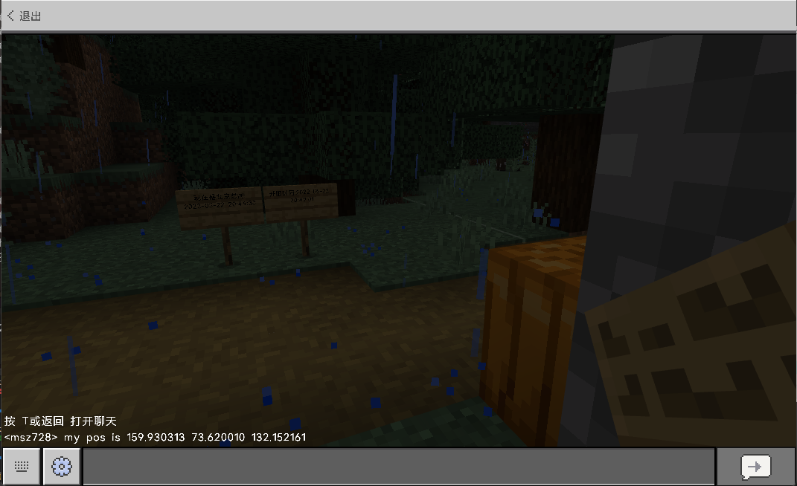
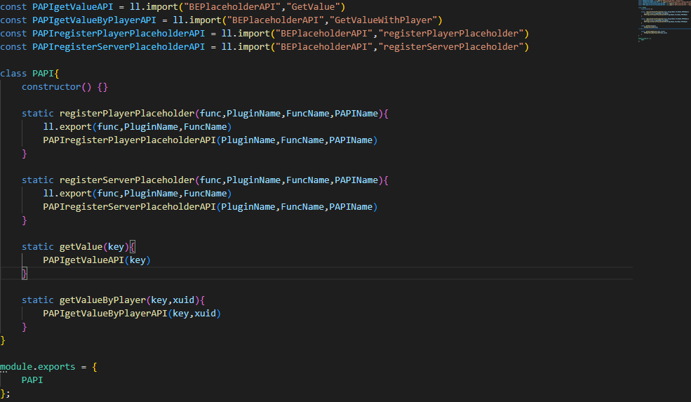
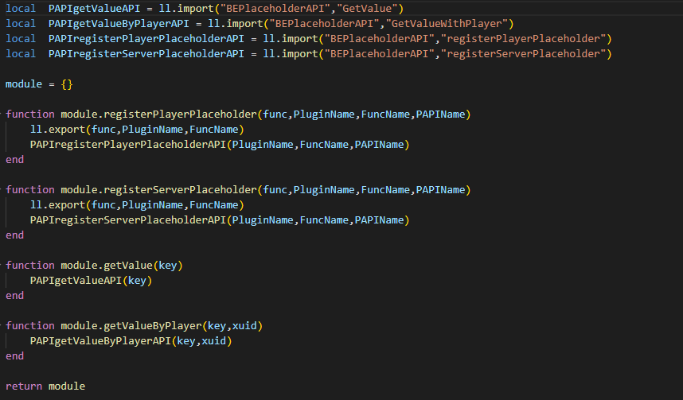

# BEPlaceholderAPI

##### English | [简体中文](README_zh.md)
`BEPlaceholderAPI` is a plug-in to add public variables to the game or plug-in, plug-in developers and owners to provide very rich and practical functions.

## For the server owner
including but not limited to below:
- Dynamic Sgin variables

- Plug-in public variables
> For example: sidebar HeadShow and so on
- Chat public variables

For each feature in this plugin, you can use the command "/papi" or revise the config file in "/plugins/BEPlaceholderAPI/" to turn it on and off at any time.

*You can disable the above functions*

## For plug-in developers
- 

    
Script plug-in fast access API
    Js language API
    
    Lua language API
    
    

### 💻Download
Please go to [Releases page](https://github.com/dreamguxiang/BEPlaceholderAPI/releases)to download the latest version.

### 🎯 安装和使用

This plugin is developed based on [LiteLoaderBDS](https://github.com/LiteLDev/LiteLoaderBDS), LL provides a powerful API system that greatly reduces development and maintenance costs, so to load BEPlaceholderAPI you need to install LiteLoaderBDS and drop it into its generated s Plugins folder in order to load and run correctly.

### 🏆 Acknowledgement

- Thank Major development of [dreamguxiang](https://github.com/dreamguxiang).
- Thank [HuoHuas001](https://github.com/HuoHuas001)'s help and contribution.
- Thank Help and suggestions from [LiteLDev](https://github.com/LiteLDev) development team members.

### 📞 Contact

NULL

⚠️ Warning
Please do not reproduce without permission, integration! This may keep it from ever being updated

Extra Restrictions & Exceptions
You can't distribute, integrate, etc. without my authorized permission